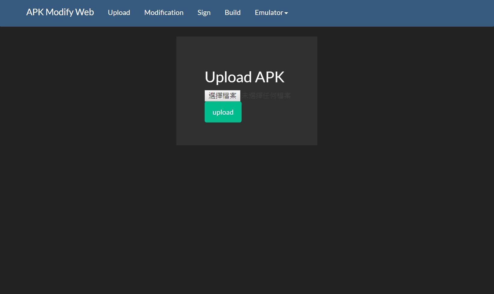
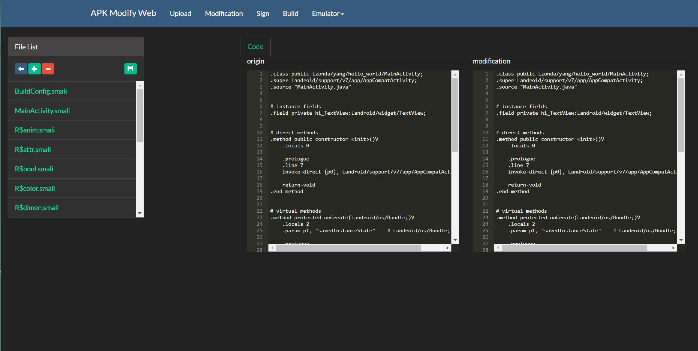
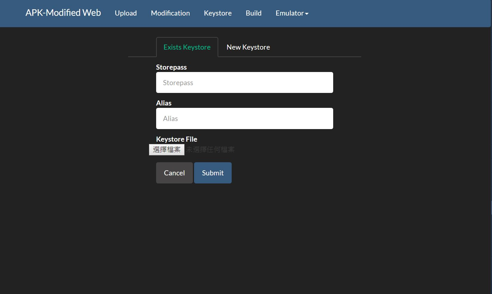
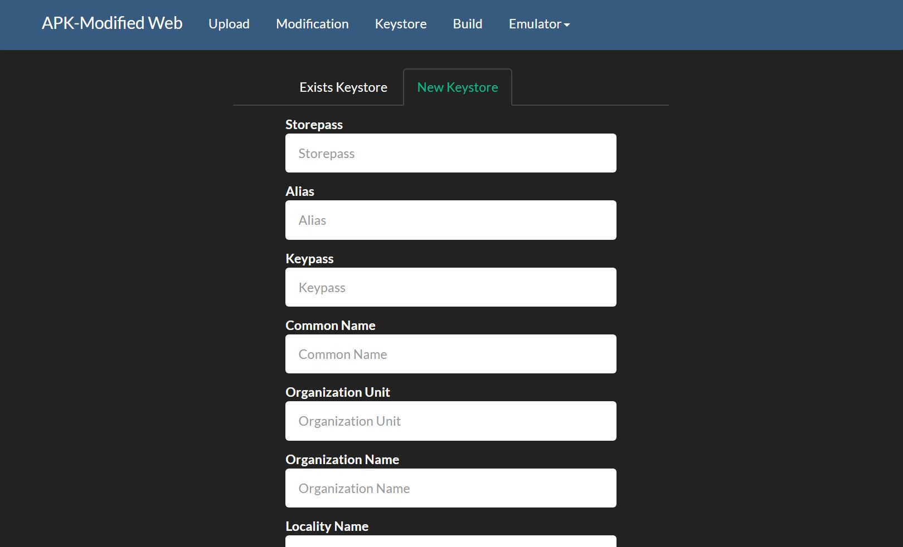
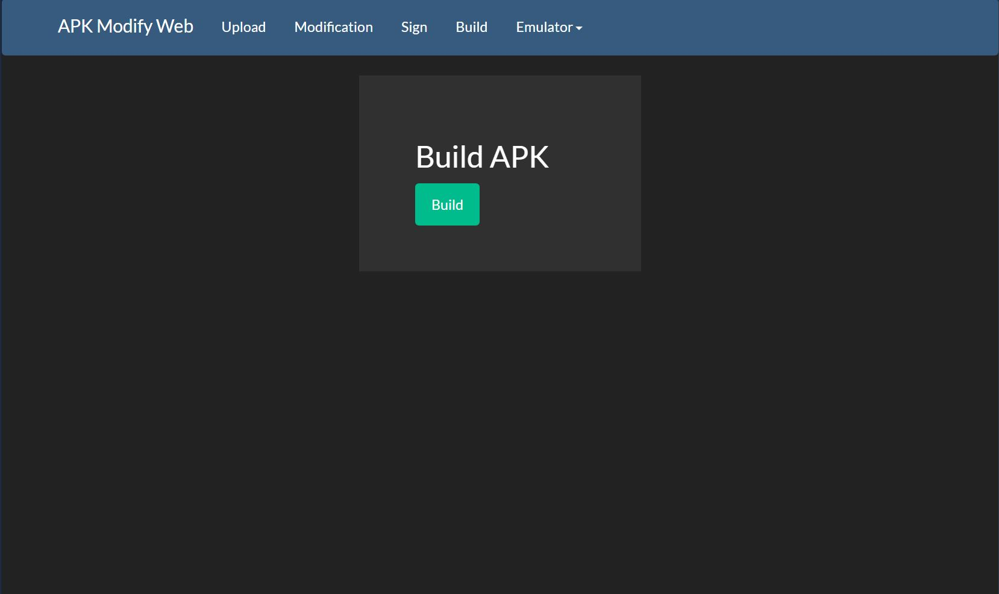
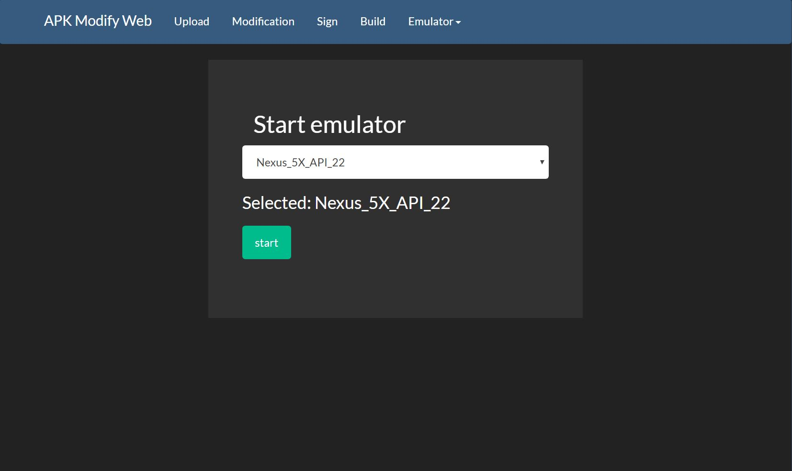
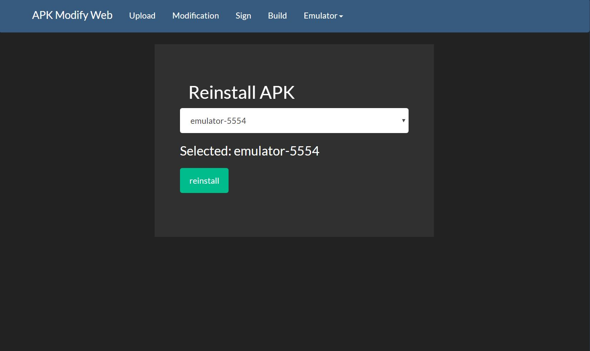
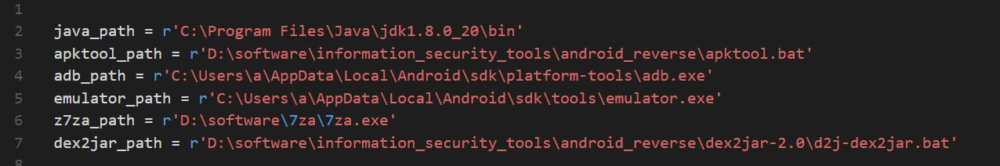

# APK-Modified Web

## 目的
Web顯示的修改apk工具，之所以會用Web顯示，是為了讓所有裝置都能使用，此工具會有RWD，所以開起來後，可以用平板和手機使用此工具喔！  

## 目前畫面
index  
  
upload  
  
modification
    
exists_keystore  
  
new_keystore  
  
build  
  
start_emulator  
  
reinstall  
  

## 使用須知
先到flask_config把上面的路徑改成自己電腦的路徑。  
  

目前都沒做什麼防呆，所以請愛惜它。
請按造此順序使用:  
upload -> (modification ->) sign -> build -> emulator  

不要開在對外網路，儲存檔案那邊，目前為求方便，那邊有RCE漏洞。  

## 未來
1. 讓網頁可以控制android emulator (目前想到用vnc，但android emulator用vnc時，一直開不起來)  
2. 增加看java code的功能  
3. 流程圖  
4. 讓網頁有常用的adb功能，例如： 上傳下載檔案  
5. 修改xml時，能有即時的畫面顯示  
6. 新增、刪除檔案  
7. 新增Linux版本  