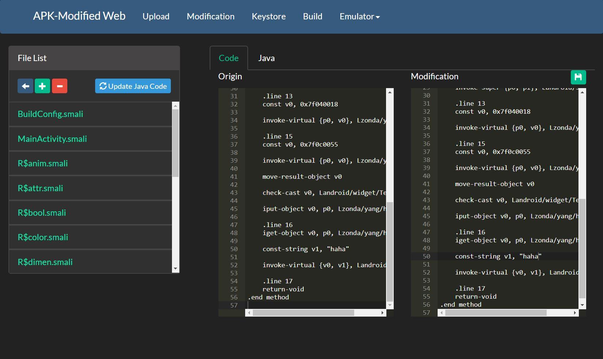
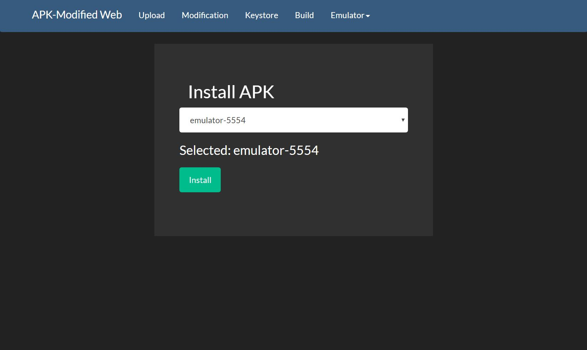

# APK-Modified Web

## 目的
Web顯示的修改apk工具，之所以會用Web顯示，是為了讓所有裝置都能使用，此工具會有RWD，所以開起來後，可以用平板和手機使用此工具喔！  

## 目前畫面
index  
  
upload  
  
modification
  
java
  
exists_keystore  
  
new_keystore  
  
build  
  
start_emulator  
  
install  
  

## 使用須知
先到flask_config把上面的路徑改成自己電腦的路徑。  
  

目前都沒做什麼防呆，所以請愛惜它。
請按造此順序使用:  
upload -> (modification ->) sign -> build -> emulator  

需要loading的地方，都沒做loading的動畫，請耐心等候  
(upload, update java code, build, install)
  

## 未來
1. 讓網頁可以控制android emulator (目前想到用vnc，但android emulator用vnc時，vnc viewer一直黑頻)  
2. 看log的功能 目前還有點問題  
3. 讓網頁有常用的adb功能，例如： 上傳下載檔案  
4. 修改xml時，能有即時的畫面顯示  
5. 新增、刪除資料夾  
6. 新增Linux版本  
7. 流程圖  
8. 包成docker  
9. 做loading畫面  